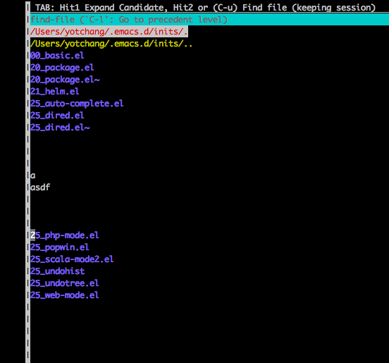

=======================
 Emacsを始めてみました
=======================

Emacsを始めてみた。

なんでEmacsを使いたかったのかというと、Tinkererでブログを書くのに適してるかなーというのと、
Lispと親和性が高いかなーという理由です。

しかし実際Emacsを使い出してみると全然うまくいかず、中々デレてくれないのでデレてくれるまでEmacsに関して書いていこうかなとおもいます。

躓いたところとかアレなところとか
================================

* Anything?Helm?どっちやねん
* 古い情報と新しい情報があまりにも入り乱れてわけがわからないよ
* 設定ファイルを弄っているだけで日が暮れる
* あまり情報が無い
* 少し古くさい
* Vimがまぶしく見える

今の時点で良いところ
====================
* C-aとかC-eとかわかりやすい
* 文字を書きながらC-hogeでコマンドを打てるのでシームレス

rst.elは良いですね
==================

C-=で=を自動で付けてくれたりと便利です。
この文章もrst.elで書いています。Emacsは文章を書くのに向いているんでしょうね。

未だに不明なところ
==================

なぜこうなる…

   Emacsのよくわからない挙動

.. author:: default
.. categories:: Emacs
.. tags:: Emacs
.. comments::
